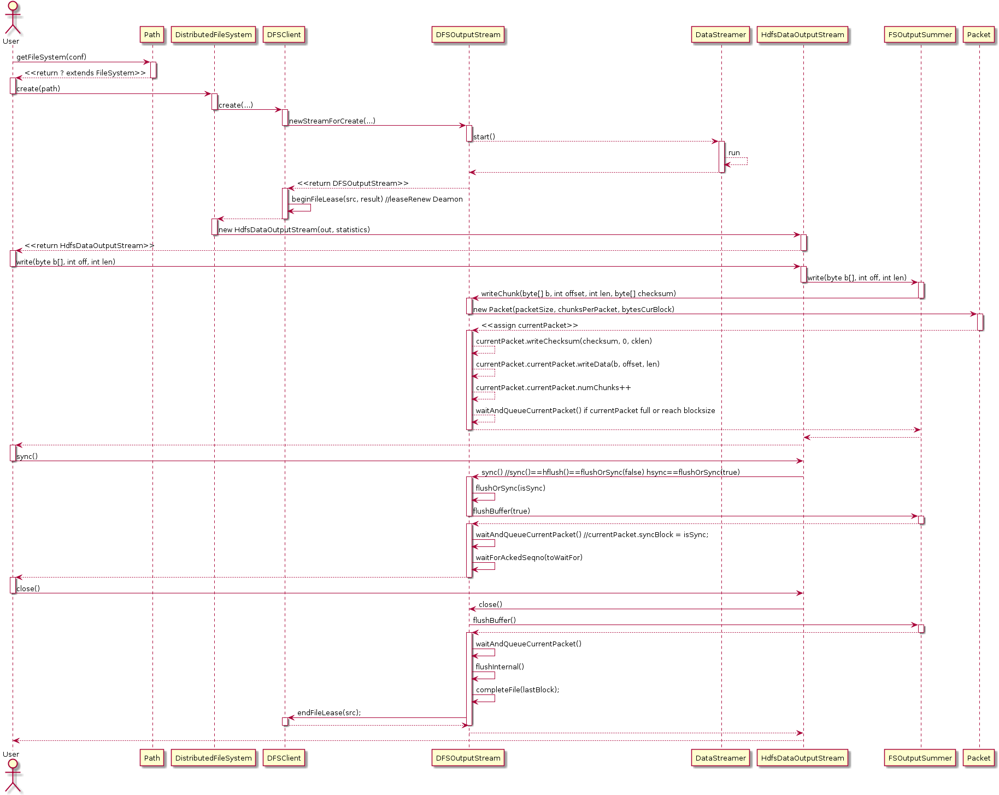
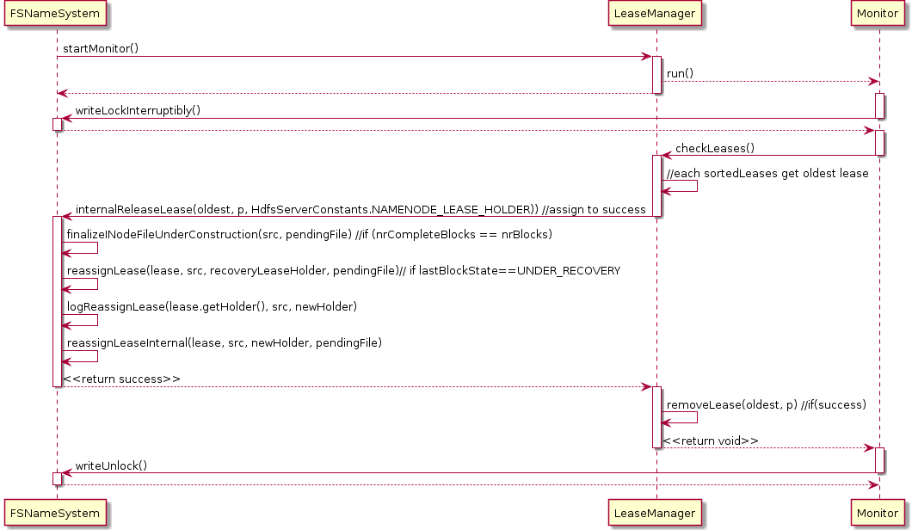

#NameNode持续报block recover直至NN无响应
##问题现象
NN日志中始终报以下错误，造成NN无响应，并且log4j写出很多日志，其中都是此消息。
```
2013-11-21 18:25:07,534 INFO org.apache.hadoop.hdfs.server.namenode.LeaseManager: Started block recovery for file /data/input/applog/20131119/BAA-OWINMSMQ1_2013111920.log.1384870964955 lease [Lease.  Holder: DFSClient_NONMAPREDUCE_766031715_42, pendingcreates: 1]
2013-11-21 18:25:07,534 INFO org.apache.hadoop.hdfs.server.namenode.LeaseManager: Lease [Lease. Holder: DFSClient_NONMAPREDUCE_766031715_42, pendingcreates: 1] has expired hard limit
2013-11-21 18:25:07,534 INFO org.apache.hadoop.hdfs.server.namenode.FSNamesystem: Recovering lease=[Lease.  Holder: DFSClient_NONMAPREDUCE_766031715_42, pendingcreates: 1], src=/data/input/applog/20131119/BAA-OWINMSMQ1_2013111920.log.1384870964955
```
##问题原因
NN中LeaseManager的Monitor定时检查文件是否硬过期（同时加写锁），如果发现某文件过期则调用FSNameSystem.internalReleaseLease()方法关闭文件，但调用该方法中会触发FSNameSystem.logReassignLease(),同时此方法中也有写锁，造成editlog中的状态不同同步。而interalReleaseLease方法始终返回false,最终功造成死循环。Fix方式见HDFS 4186。



```
//LeaseManager Monitor
  class Monitor implements Runnable {
    final String name = getClass().getSimpleName();

    /** Check leases periodically. */
    @Override
    public void run() {
      for(; shouldRunMonitor && fsnamesystem.isRunning(); ) {
        try {
          fsnamesystem.writeLockInterruptibly();
          try {
            if (!fsnamesystem.isInSafeMode()) {
              checkLeases();
            }
          } finally {
            fsnamesystem.writeUnlock();
          }
  
  
          Thread.sleep(HdfsServerConstants.NAMENODE_LEASE_RECHECK_INTERVAL);
        } catch(InterruptedException ie) {
          if (LOG.isDebugEnabled()) {
            LOG.debug(name + " is interrupted", ie);
          }
        }
      }
    }
  }
```

```
//LeaseManager 
  private synchronized void checkLeases() {
    assert fsnamesystem.hasWriteLock();
    for(; sortedLeases.size() > 0; ) {
      final Lease oldest = sortedLeases.first();
      if (!oldest.expiredHardLimit()) {
        return;
      }

      LOG.info("Lease " + oldest + " has expired hard limit");

      final List<String> removing = new ArrayList<String>();
      // need to create a copy of the oldest lease paths, becuase 
      // internalReleaseLease() removes paths corresponding to empty files,
      // i.e. it needs to modify the collection being iterated over
      // causing ConcurrentModificationException
      String[] leasePaths = new String[oldest.getPaths().size()];
      oldest.getPaths().toArray(leasePaths);
      for(String p : leasePaths) {
        try {
          if(fsnamesystem.internalReleaseLease(oldest, p, HdfsServerConstants.NAMENODE_LEASE_HOLDER)) {
            LOG.info("Lease recovery for file " + p +
                          " is complete. File closed.");
            removing.add(p);
          } else {
            LOG.info("Started block recovery for file " + p +
                          " lease " + oldest);
          }
        } catch (IOException e) {
          LOG.error("Cannot release the path "+p+" in the lease "+oldest, e);
          removing.add(p);
        }
      }

      for(String p : removing) {
        removeLease(oldest, p);
      }
    }
  } 
```

```
//FSNameSystem
  private void logReassignLease(String leaseHolder, String src,
      String newHolder) {
    writeLock();
    try {
      getEditLog().logReassignLease(leaseHolder, src, newHolder);
    } finally {
      writeUnlock();
    }
    getEditLog().logSync();
  }
```

##解决办法

