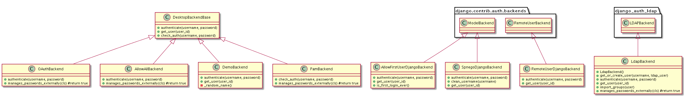

##hue验证功能模块
 
 * DesktopBackendBase  
  > Abstract base class for providing external authentication schemes.Extend this class and implement check_auth

 * AllowFirstUserDjangoBackend
  > Allows the first user in, but otherwise delegates to Django's ModelBackend.

 * OAuthBackend
  > Deprecated, use liboauth.backend.OAuthBackend instead
  > Heavily based on Twitter Oauth: https://github.com/simplegeo/python-oauth2#logging-into-django-w-twitter
  > Requires: python-oauth2 and httplib2
  > build/env/bin/python setup.py install https://github.com/simplegeo/python-oauth2
  > build/env/bin/pip install httplib2

 * AllowAllBackend
  > Authentication backend that allows any user to login as long
  > as they have a username. The users will be added to the 'default_user_group'. 

 * DemoBackend
  > Log automatically users without a session with a new user account.

 * PamBackend
  > Authentication backend that uses PAM to authenticate logins. The first user to
  > login will become the superuser.

 * LdapBackend
  > Authentication backend that uses LDAP to authenticate logins.
  > The first user to login will become the superuser.
 
 * SpnegoDjangoBackend
  > note about configuration:
  > The HTTP/_HOST@REALM principal (where _HOST is the fully qualified domain
  > name of the server running Hue) needs to be exported to a keytab file.
  > The keytab file can either be located in /etc/krb5.keytab or you can set
  > the KRB5_KTNAME environment variable to point to another location
  > (e.g. /etc/hue/hue.keytab).

 * RemoteUserDjangoBackend
  > Delegates to Django's RemoteUserBackend and requires HueRemoteUserMiddleware
  
 
